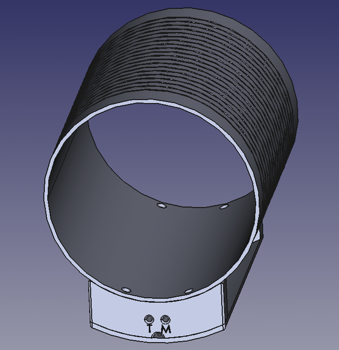

# Solenoid RF coil - 20.5cm, f=2.04Mhz

A multipurpose RF coil for low-field MRI of the OSI² ONE system. Designed to image the ACR phantom. 

## Specifications
- Inner diameter: 205mm
- Outer diamter: 213mm
- Solenoid length: 200mm
- Housing length: 240mm
- Number of turns: 20
- Number of segmentations: 3

## Authors and contributors

Original design by Tom O'Reilly (t.o_reilly@lumc.nl), LUMC, Leiden, Netherlands.

## (Known) builds
Name | Email | Institution 
|-----|-----|-----|
Tom O'Reilly | t.o_reilly@lumc.nl | LUMC, Leiden, Netherlands 
Lukas Winter | lukas.winter@ptb.de | Physikalisch-Technische Bundesanstalt (PTB), Berlin, Germany

## License and Liability
Please check the [DISCLAIMER.pdf](DISCLAIMER.pdf).

